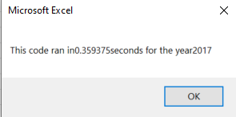
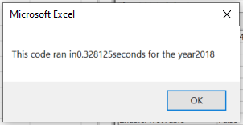
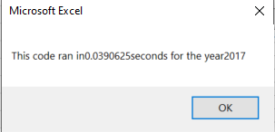
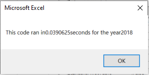

# Stock Analysis

## Overview of Project

### Purpose
The purpose of this analysis is to assist Steve in analyzing 2017 and 2018 stock data using VBA macros
## Results

### Analysis of Outcomes Based on Module 2

See below for run time of 2017 stock data utilizing the methods described in module 2

 

See below for run time of 2018 stock data utilizing the methods described in module 2

 


See below for code utilized based on module 2
```
Sub AllStockAnalysis()

    Dim startTime As Single
    Dim endTime As Single
    

    yearValue = InputBox("What year would you like to run the analysis on?")
    
        startTime = Timer

'1)Format the output sheet on the "All Stocks Analysis" Worksheet.

    Worksheets("All Stocks Analysis").Activate

        Range("A1").Value = "All Stocks (" + yearValue + ")"
        'Create a header row
        Range("A3").Value = "Ticker"
        Range("B3").Value = "Total Daily Volume"
        Range("C3").Value = "Return"

'2) Initialize an array of all tickers

    Dim tickers(12) As String

    tickers(0) = "AY"
    tickers(1) = "CSIQ"
    tickers(2) = "DQ"
    tickers(3) = "ENPH"
    tickers(4) = "FSLR"
    tickers(5) = "HASI"
    tickers(6) = "JKS"
    tickers(7) = "RUN"
    tickers(8) = "SEDG"
    tickers(9) = "SPWR"
    tickers(10) = "TERP"
    tickers(11) = "VSLR"

'3a) Initialize variables for the starting price and ending price

    Dim startingPrice As Single
    Dim endingPrice As Single
    
    
'3b) Activate the data worksheet
    
    Worksheets(yearValue).Activate

'3c) Find the number of rows to loop over.

    RowCount = Cells(Rows.Count, "A").End(xlUp).Row
    
'4) Loop through the tickers
For i = 0 To 11

    ticker = tickers(i)
    totalVolume = 0
    
    '5) Loop through rows in the data
    
    Worksheets(yearValue).Activate
    For j = 2 To RowCount
    
        '5a) Find total volume for the current ticker
    
        If Cells(j, 2).Value = ticker Then
        
            totalVolume = totalVolume + Cells(j, 9).Value
        
        End If
    
        '5b) Find starting price for the current ticker
        If Cells(j - 1, 2).Value <> ticker And Cells(j, 2).Value = ticker Then
            
            startingPrice = Cells(j, 7).Value
        
        End If
        
        '5c)Find ending price for the current ticker
        If Cells(j + 1, 2).Value <> ticker And Cells(j, 2).Value = ticker Then
            
            endingPrice = Cells(j, 7).Value
        
        End If
        
    Next j
    
'6)Output the data for the current ticker
    Worksheets("All Stocks Analysis").Activate
    Cells(4 + i, 1).Value = ticker
    Cells(4 + i, 2).Value = totalVolume
    Cells(4 + i, 3).Value = endingPrice / startingPrice - 1
    
    
Next i

    endTime = Timer
    MsgBox "This code ran in" & (endTime - startTime) & "seconds for the year" & (yearValue)

'Formatting
Worksheets("All Stocks Analysis").Activate
Range("A3:C3").Font.Bold = True
Range("A3:C3").Borders(xlEdgeBottom).LineStyle = xlContinuous
Range("B4:B15").NumberFormat = "$#,##0"
Range("C4:C15").NumberFormat = "0.#0%"
Columns("B").AutoFit
dataRowStart = 4
dataRowEnd = 15

For i = dataRowStart To dataRowEnd

    If Cells(i, 3) > 0 Then
        'Color the cell green
        Cells(i, 3).Interior.Color = vbGreen
    
    ElseIf Cells(i, 3) < 0 Then
        'Color the cell red
        Cells(i, 3).Interior.Color = vbRed

    Else
        'Clear the cell color
        Cells(i, 3).Interior.Color = xlNone
    
    End If

Next i


End Sub
```

### Analysis of Outcomes After Refractoring
See below for run time of 2017 stock data after refactoring 

 

See below for run time of 2018 stock data after refactoring

 

See below for code utilized based on module 2
```
Sub AllStocksAnalysisRefactored()

    
    Dim startTime As Single
    Dim endTime As Single

    yearValue = InputBox("What year would you like to run the analysis on?")
    
        startTime = Timer
        
    '1) Format the output sheet on All Stocks Analysis worksheet
    Worksheets("All Stocks Analysis").Activate
    
    Range("A1").Value = "All Stocks (" + yearValue + ")"
    
    '2) Create a header row
    Cells(3, 1).Value = "Ticker"
    Cells(3, 2).Value = "Total Daily Volume"
    Cells(3, 3).Value = "Return"

    '3) Initialize array of all tickers
    Dim tickers(12) As String
    
    tickers(0) = "AY"
    tickers(1) = "CSIQ"
    tickers(2) = "DQ"
    tickers(3) = "ENPH"
    tickers(4) = "FSLR"
    tickers(5) = "HASI"
    tickers(6) = "JKS"
    tickers(7) = "RUN"
    tickers(8) = "SEDG"
    tickers(9) = "SPWR"
    tickers(10) = "TERP"
    tickers(11) = "VSLR"
    
    '4a) Activate data worksheet
    Worksheets(yearValue).Activate
    
    '4b) Get the number of rows to loop over
    RowCount = Cells(Rows.Count, "A").End(xlUp).Row
    
    '5a) Create a ticker Index
    tickerIndex = 0
    ticker = tickers(tickerIndex)

    '5b) Create three output arrays
    Dim tickerVolumes(12) As Long
    Dim tickerStartingPrices(12) As Single
    Dim tickerEndingPrices(12) As Single
    
    
    '6a) Initialize ticker volumes to zero
    tickerVolumes(tickerIndex) = 0
        
    '6b) loop over all the rows
    For i = 2 To RowCount
        
        '7a) Increase volume for current ticker
    
            tickerVolumes(tickerIndex) = tickerVolumes(tickerIndex) + Cells(i, 9).Value
    
        '7b) Check if the current row is the first row with the selected tickerIndex.
       
         If Cells(i - 1, 2).Value <> tickers(tickerIndex) And Cells(i, 2).Value = tickers(tickerIndex) Then
            
            tickerStartingPrices(tickerIndex) = Cells(i, 7).Value
            
         End If
        
        '7c) check if the current row is the last row with the selected ticker
        
         If Cells(i + 1, 2).Value <> tickers(tickerIndex) And Cells(i, 2).Value = tickers(tickerIndex) Then
            
            tickerEndingPrices(tickerIndex) = Cells(i, 7).Value
            
            '7d Increase the tickerIndex.
            tickerIndex = tickerIndex + 1
            
         End If
            
    Next i
    
    
    '8) Loop through your arrays to output the Ticker, Total Daily Volume, and Return.
    For i = 0 To 11
        
        Worksheets("All Stocks Analysis").Activate
        Cells(4 + i, 1).Value = tickers(i)
        Cells(4 + i, 2).Value = tickerVolumes(i)
        Cells(4 + i, 3).Value = tickerEndingPrices(i) / tickerStartingPrices(i) - 1
        
    Next i
    
    endTime = Timer
    MsgBox "This code ran in" & (endTime - startTime) & "seconds for the year" & (yearValue)
    
    '9) Formatting
    Worksheets("All Stocks Analysis").Activate
    Range("A3:C3").Font.FontStyle = "Bold"
    Range("A3:C3").Borders(xlEdgeBottom).LineStyle = xlContinuous
    Range("B4:B15").NumberFormat = "#,##0"
    Range("C4:C15").NumberFormat = "0.0%"
    Columns("B").AutoFit

    dataRowStart = 4
    dataRowEnd = 15

    For i = dataRowStart To dataRowEnd
        
        If Cells(i, 3) > 0 Then
            
            Cells(i, 3).Interior.Color = vbGreen
            
        Else
        
            Cells(i, 3).Interior.Color = vbRed
            
        End If
        
    Next i

End Sub


```

## Summary

**What are the advantages or disadvantages of refactoring code?*

The advantages of refactoring code is that the coder may discover a more efficient, cleaner, and space saving method by which a refactored code can reach the same results as the original code. Additionally, a refactored code may even increase performance by having a lower run time than the original code. The disadvantage of refactoring code is opportunity cost, since the benefit reaped from the refactored code may not outweigh the time consumed to create it. 

**How do these pros and cons apply to refactoring the original VBA script?**

Based on my analysis of the plays campaign outcomes based on goals, I noticed that none of the campaigns were canceled; they either succeeded to meet their targets or failed. Additionally, campaigns that were less than $1000 had the highest percentage of success, whereas campaigns greater than $45,000 and less than $49,999 had the highest percentage of failure. Based on this, we can say that, generally speaking, campaigns with lower dollar goals tend to be more successful than campaigns that were very expensive. 

